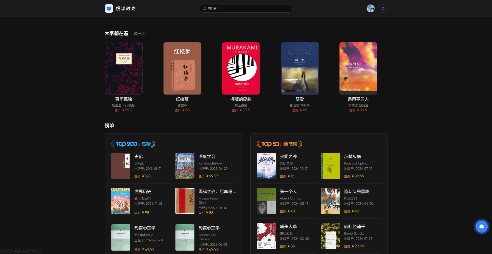

<div align=center>
 <div align=center margin="10em" style="margin:4em 0 0 0;font-size: 30px;letter-spacing:0.3em;">

 </div>
 <h2 align=center style="margin: 2em 0; padding-bottom:1em;">Read Joy</h2>

<div>
      <a href="https://github.com/Kiwi233333/read-joy" target="_blank">
        
      </a>
      <a href="https://github.com/Kiwi233333/read-joy/stargazers" target="_blank">
        
      </a>
    </div>
    <div>
      <a href="https://github.com/Kiwi233333/read-joy/commits" target="_blank">
        
      </a>
      <a href="https://github.com/Kiwi233333/read-joy/issues" target="_blank">
        
      </a>
      <a href="https://github.com/Kiwi233333/read-joy/blob/master/LICENSE" target="_blank">
 
      </a>
    </div>
    <div>
      <a href="https://app.netlify.com/sites/readjoy/deploys">
          
      </a>
    </div>


Language: Simplified Chinese | [English](./README.en.md)
</div>

## Introduction

Welcome to Read-Joy 🎉: a web application that makes reading more beautiful and convenient! Based on the modern Nuxt3 and Spring Boot technology stack, we have created a simple yet sophisticated reading platform for you. Whether you are a book lover or a creator seeking inspiration, this platform can meet your needs.

Note: This project is a `course project`, and the database is `fixed` due to the topic, so the implemented features are limited and for learning purposes only.

### Features That May Interest You

- **Elegant Interface**: We have carefully designed the user interface to ensure you enjoy an unparalleled visual experience while reading.
- **Smart Recommendations**: Through advanced AI technology, we recommend the books that suit you best, making every reading experience full of surprises.
- **Diverse Features**: From dark mode to convenient search features, Read-Joy provides you with a comprehensive reading experience.
- **Community Interaction**: Share your insights with other readers, participate in discussions, and enhance your reading enjoyment.

Join us to start your reading journey and discover more exciting content! Whether it's classic literature or the latest bestsellers, Read-Joy will be your best companion. Let's sail through the sea of books together and enjoy every moment of reading joy!

## Default Account

- Username: ikun233
- Password: 123456

## Project Screenshots

- Frontend - Home Page


- Global Dark Mode



- Frontend - Search Page


- Frontend - Detail Page


- Frontend - AI Recommendations


- Frontend - Login


- Backend - Admin Page


- Backend - Admin Dark Mode


- Backend - User Page


- Backend - Book Page


- Backend - Category Page


- Backend - Comment Page


- Backend - Resource Page


- Mobile Adaptation

<div align=center style="margin:1em; display:flex;flex-wrap:wrap;justify-content:center;">
 

 

 

</div>

## ⏳ Getting Started

### ✨ Development

#### 🎨 Frontend

```sh
# Install dependencies
pnpm install
# Start the project
pnpm run dev
```

#### 🖥 Backend

```sh
pnpm run dev
```

Backend:

Open the project in Idea, and start the `com.readjoy.readjoyapi.ReadJoyApiApplication` class.

### 📦 Deployment

#### 1. Frontend Deployment
  - Add and configure `.prod.development` in the frontend root directory (refer to `.env.development`)
  - Run `pnpm run build` to package
  - Deploy to the server, such as Nginx, Apache, Tomcat, etc.

```sh
# Frontend packaging
pnpm run build

# Frontend running
pnpm run start
```

#### 2. Backend Deployment
  - Add and configure `.prod.properties` in the backend root directory (refer to `.dev.properties`)
  - Run `mvn clean package` to package
  - Deploy to the server, such as Tomcat, Jetty, etc.

```sh
# Backend packaging
mvn clean package -Dmaven.test.skip=true

# Backend running
java -jar target/read-joy-api-1.0.0.jar --spring.profiles.active=prod
```

### 🔧 Frontend - Tech Stack

<details>
<summary>Expand</summary>

| Category      | Technology/Component | Version     |
| ------------ | ------------------ | ----------- |
| Package Manager | pnpm             | 9.14.4      |
| Framework     | Nuxt3            | ^3.14.1592  |
| UI Library    | Element Plus      | ^2.9.1      |
|               | Radix Vue         | ^1.9.11     |
|               | Element Plus Icons | >=0.2.6     |
| State Management | Pinia            | ^2.3.0      |
|               | Pinia Persisted State | ^4.2.0   |
| Build Tools   | Vite             | ^6.0.2      |
|               | Webpack          | ^5          |
| Static Site Generation | Nuxi             | -           |
| Server-Side Rendering | Nitro            | -           |
| CSS Framework | Tailwind CSS      | ^3.4.17     |
|               | Tailwind Merge    | ^2.5.5      |
|               | Tailwind CSS Animate | ^1.0.7    |
| TypeScript    | TypeScript       | 5.7.2       |
| ESLint Config  | @antfu/eslint-config | ^3.12.0    |
|               | @nuxt/eslint      | ^0.7.4      |
|               | @unocss/eslint-config | ^0.65.2   |
| Code Quality  | ESLint           | ^9.17.0     |
|               | Consola          | ^3.2.3      |
| Animation     | @formkit/auto-animate | 0.8.2     |
| Charts        | ECharts          | ^5.5.1      |
| Date Handling | Dayjs            | ^1.11.13    |
| Markdown Editor | MD-Editor V3    | ^5.1.1      |
| Internationalization | -                | -           |
| PWA           | @vite-pwa/nuxt   | ^0.10.6     |
| Vue Plugins   | @vueuse/nuxt     | ^12.2.0     |
| Version Control Hooks | Husky            | -           |
| Code Submission Standards | lint-staged      | -            |

</details>

## 🖥 Backend - Tech Stack

<details>
<summary>Expand</summary>

| Type         | Library                                      | Version    | Functional Description                |
|-------------|----------------------------------------------|-----------|--------------------------------------|
| **Main Framework** | **Spring Boot**                           | **3.3.5** | **Spring Boot core dependency**         |
|              | spring-boot-starter-web                     |           | Provides Web application support       |
|              | spring-boot-starter-validation              |           | Provides data validation capabilities  |
| **Database & ORM** | **MyBatis Plus**                         | **3.5.9** | **Enhanced MyBatis functionality**     |
|              | mybatis-plus-spring-boot3-starter           |           |                                      |
|              | mybatis-plus-jsqlparser                    |           | MyBatis Plus integrated JSqlParser for pagination and more |
|              | mybatis-plus-join-boot-starter             | 1.5.2     | Provides MyBatis Plus Join multi-table query support |
|              | **MySQL**                                   |           | **MySQL database driver**              |
|              | mysql-connector-j                           | 8.0.29    |                                      |
| **Caching**   | **Redis**                                   | **3.3.5** | **Provides Redis caching support**     |
|              | spring-boot-starter-data-redis              |           | Used for interface rate limiting, data caching, etc. |
| **Security**  | **JWT**                                     | **4.2.1** | **Provides JWT authentication support**|
|              | java-jwt                                    |           | User authentication and authorization    |
|              |
 **mica-xss**                                | **2.7.6** | **Prevents XSS attacks**              |
| **Utility Libraries** | **Hutool**                           | **5.8.25** | **A Java utility library providing various utility classes** |
|              | hutool-all                                  |           |                                      |
|              | **Lombok**                                  | **1.18.24**| **A tool to simplify Java object encapsulation** |
|              | lombok                                      |           |                                      |
| **API Documentation** | **Swagger**                       | **4.4.0** | **Provides Swagger 3 API documentation support** |
|              | knife4j-openapi3-jakarta-spring-boot-starter|           |                                      |
| **Logging**   | **Log4j2**                                  | **2.17.0**| **Provides logging support**           |

</details>

## Trends


## Contribution

We welcome contributions to the project! Please ensure you run the `lint` command for code checks before submitting.

## License

This project is licensed under the `GNU Affero General Public License v3.0`. For specific content, please refer to the LICENSE file.

We hope you enjoy using this project! If you have any questions, please feel free to contact us at any time.
